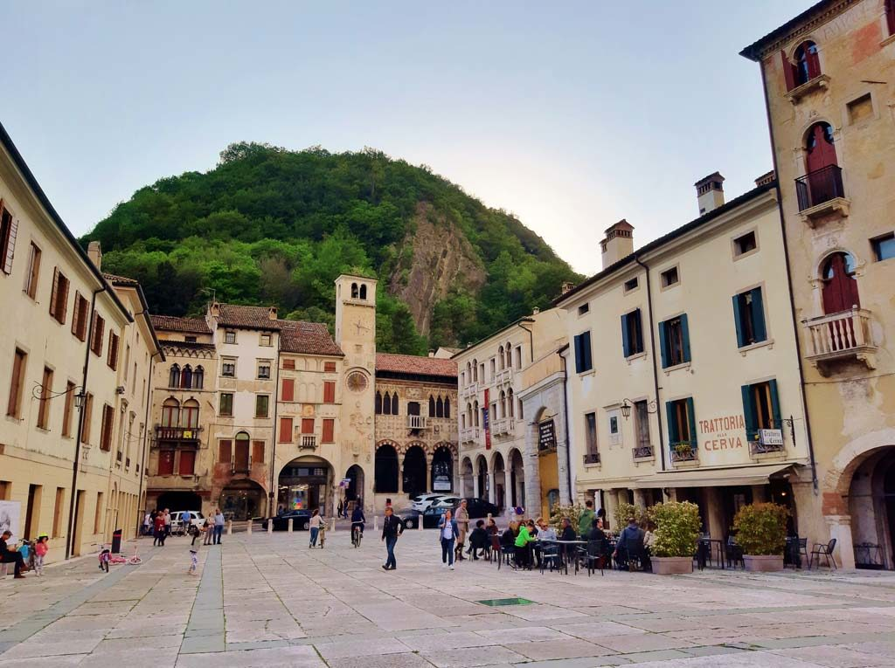
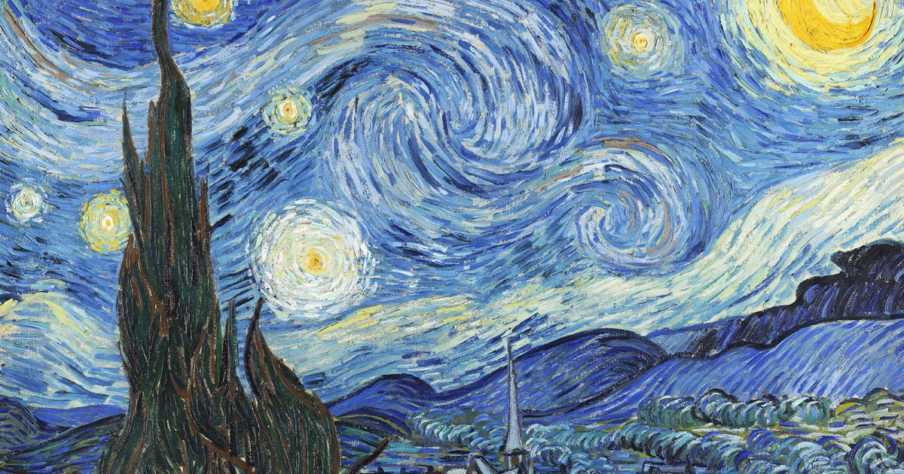
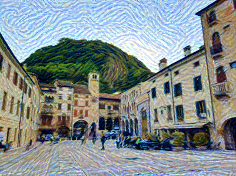
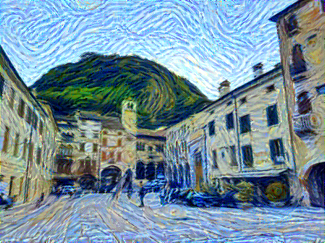
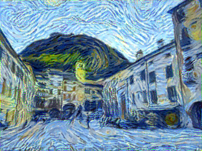

<h2>Re-implemented the Neural Style Transfer paper for educational purposes.</h2>
Every step performed has been completely inspired from the original paper and has been described inside the jupyter notebook as it was being implemented.   
The program takes in input a content image and a style image.   
The output contains the content of the first picture, styled as if it was inspired by the second one. 
  
In this example, the content image represents of my favourite areas of my hometowm and the style one is "The Starry Night" by Vincent van Gogh. The final result makes it look like the original picture was in fact made by the artist as if it was one of his paintings.
  
Obviously, this can be done with any arbitrary input and style image pairs to achieve stunning results.

<h3>Content image:</h3> 

<h3>Style image:</h3> 

<h3>Results: (after 500, 2000 and 7000 epochs)</h3> 

Feel free to check the files if you wish to see the code or the intermediate resutls.